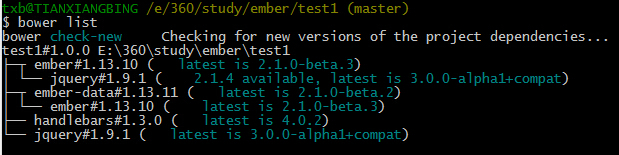

#初学emberjs
博客：[http://www.cnblogs.com/xiangbing/p/emberjs-test.html](http://www.cnblogs.com/xiangbing/p/emberjs-test.html "博客")

案例：[http://www.lovewebgames.com/emberjs/test/index.html](http://www.lovewebgames.com/emberjs/test/index.html)
#准备工作
首页我们要做的是从网上下载下来emberjs相关的文件,目前在1.x的版本中，ember是要依赖jquery（v1.7.1~2.2.0) 和handlebars(v1.x)的，有一个比较好的方式来得到这些资源，那就是用[bower](http://bower.io/).bower的安装很简单:

	npm install -g bower	

装完bower就可以使用bower来下载资源了,比如我们要下载jquery 1.9.1版本的，我们可以这样写

	bower install jquery#1.9.1

它会在当前目录下建一个bower_components的目录，把jquery的文件下载到jquery文件目录下.我们也可以把git上的项目发布到bower上，然后再从bower安装到本地，具体方法可以看这里[http://blog.fens.me/nodejs-bower-intro/](http://blog.fens.me/nodejs-bower-intro/)

我的案例已经发布在bower上，你可以直接用以下命令获取

	bower install emberjs-test

点开bower_components下的test1目录，执行
	
	npm install

安装grunt-watch,方便开发

再下载ember相关的资源

bower.json:

	"dependencies": {
	"jquery": "~1.9.1",
	"ember": "~1.13.10",
	"handlebars":"~1.3.0",
	"ember-data":"~1.13.11"
	}
执行 `bower install`
查看资源列表 `bower list`如图所示

##[开始一个例子](example/test1/)

